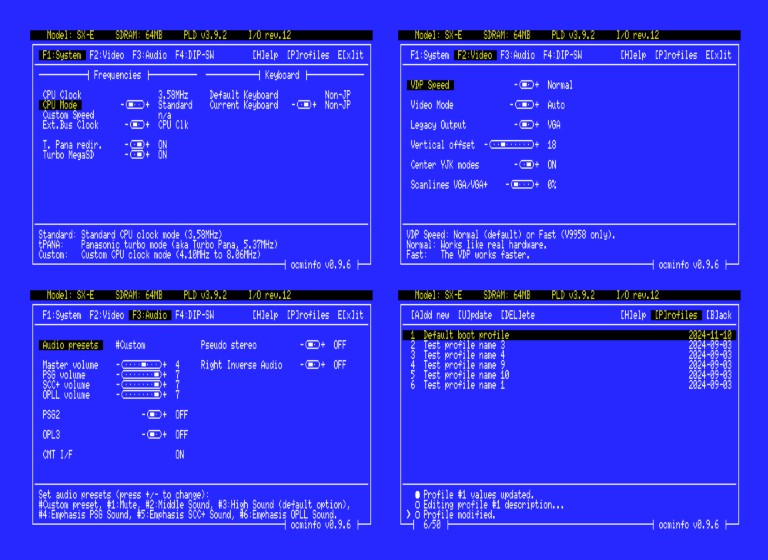

## OCMINFO for MSX++ core (OCM-PLD)

This program aims to be a helpful tool for configuring and maintaining MSX++ (OCM-PLD) FPGA-based systems.\
Currently supported devices: _1ChipMSX_, _Zemmix Neo_, _SX-1_, _SM-X_, _MCP2_, _SX-2_, _SM-X Mini_, _SM-X HB_, _u2-SX_, _DE0CV_, _SX-E_, _SX-Lite_.

The program is using the [sdcc_msxconio](https://github.com/nataliapc/sdcc_msxconio) library as a git submodule. It is based in the old _'conio'_ library from _Turbo C_.

The core can be found at the [official MSX++ repository](https://github.com/gnogni/ocm-pld-dev) maintained by [@KdL](https://github.com/gnogni).

----

### Usage

Use the function keys (_F1-F5_) or _TAB_ to navigate the different panels, and the cursor keys to select the items. A description/information text will appear at bottom.

To modify an item, you can press _SPACE_, _ENTER_, or _'+'_ to increase its value or _'-'_ to decrease it.

To mute/unmute the program sounds press _'M'_.

Press _'P'_ to get access to the Profiles panel, where you can create user profiles with different settings.

You can also use **OCMINFO** like command line program with parameters:

	Usage: OCMINFO [/n|/L] [/R] [/Q] [/?]
	
	Use without parameters to open the configuration panels.
	
	Options:
	  /n    Apply the user profile number 'n'.
	  /L    List the user profiles.
	  /R    Reset OCM to default values.
	  /Q    Quiet mode (no verbose).
	  /?    Show this help.

If you want to suggest improvements, feel free to create a github issue.

----

### Thanks

Thanks to [@KdL](https://github.com/gnogni), [@HRA!](https://github.com/hra1129), and [@ducasp](https://github.com/ducasp), for their core developments and support, and to [@cayce-msx](https://github.com/cayce-msx) for his useful [Wiki](https://github.com/cayce-msx/msxpp-quick-ref/wiki).

