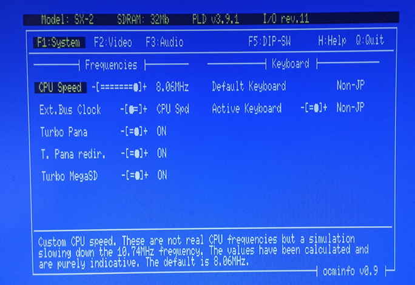

## OCMINFO for MSX++ core (OCM-PLD)

This program aims to be a helpful tool for configuring and maintaining MSX++ (OCM-PLD) FPGA-based systems.\
Currently supported devices: 1ChipMSX, Zemmix Neo, SX-1, SM-X, MCP2, SX-2, SM-X Mini, SM-X HB, DE0CV, SX-E.

The core can be found at the [official MSX++ repository](https://github.com/gnogni/ocm-pld-dev) maintained by [@KdL](https://github.com/gnogni).

 

----

### Usage

Use the function keys (_F1-F5_) to navigate between the different panels and the cursor keys to select the items. A description/information text will appear at bottom.

To modify an item, you can press _SPACE_, _ENTER_, or _'+'_ to increase its value or _'-'_ to decrease it.

If you want to suggest improvements, feel free to create an issue here.

----

### Thanks

Thanks to [@KdL](https://github.com/gnogni) and [@ducasp](https://github.com/ducasp) for their core developments and support, and to [@cayce-msx](https://github.com/cayce-msx) for his [Wiki](https://github.com/cayce-msx/msxpp-quick-ref/wiki).

